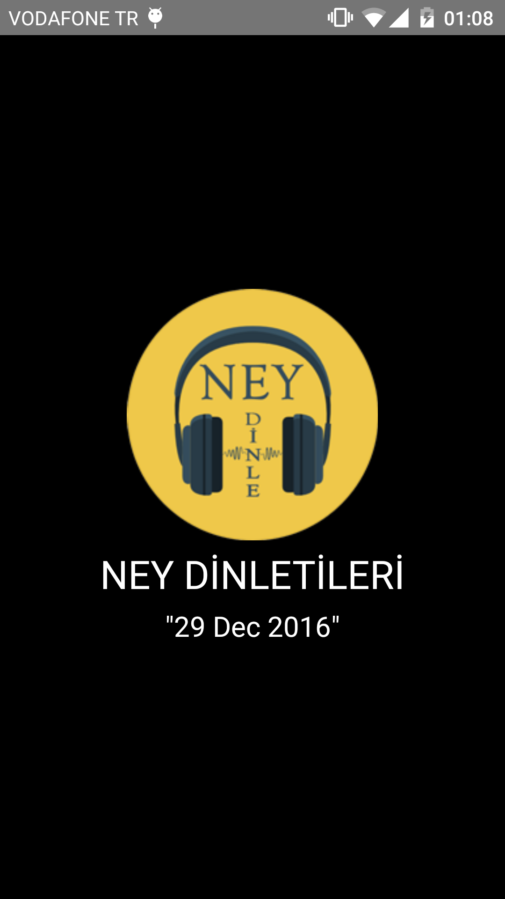
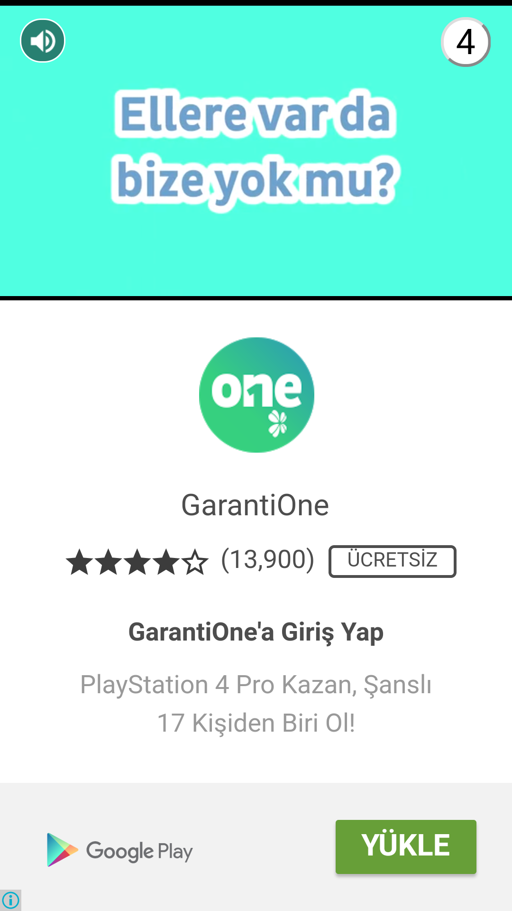
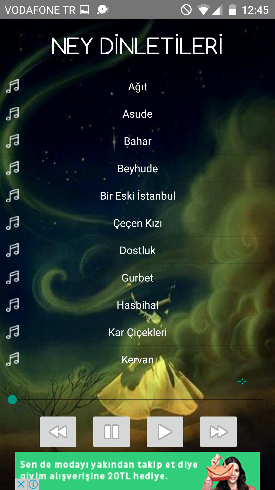
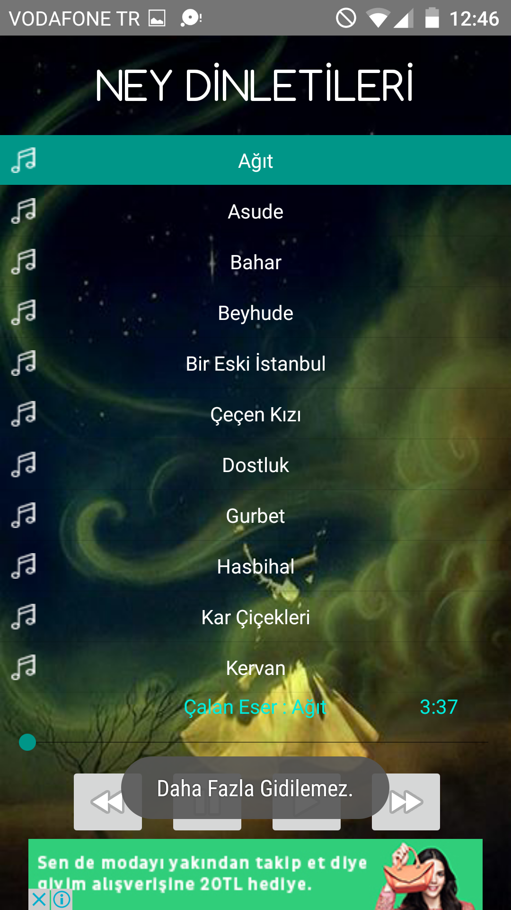
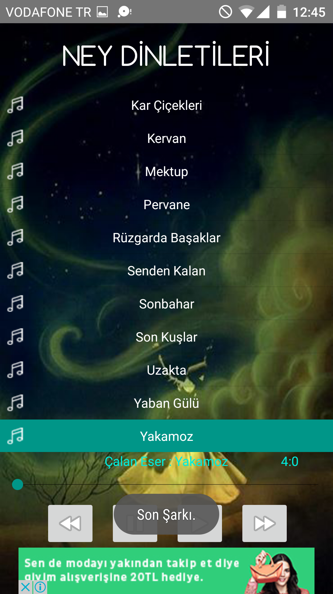
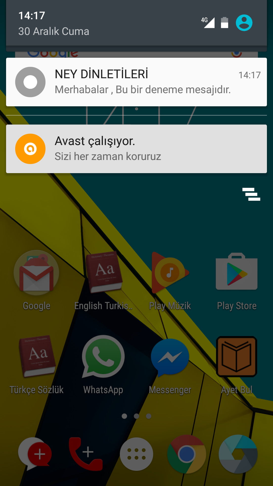

Proje Adı: NeyDinletileri

Proje Amacı: Farklı ney dinletilerinin müzik oynatıcısı olarak kullanıcılara sunulması.

*1.SPLASHSCREEN*

Uygulamada 4 sn lik bir bekleme yapıp Ana Ekranına yönlendirilir.
Buradaki tarih bilgisi web servis aracılığıyla kendi sunucumdan çekilir.

*2.GEÇİŞ REKLAMI*

Ana ekran açıldıktan hemen sonra bir geçiş reklamı yüklenir.beş dakika bir kendini yeniler yalnız uygulama açıkken bir kere gösterilir.5 dk sonra eğer uygulama kapatılıp tekrardan açılırsa reklam tekrardan yüklenir.

*3.ANA EKRAN VE LİSTVİEW YAPISI*

Listview içerisinde bulunan dinletilerin bulunduğu ana ekran. Burada seekbar , previous buton , next buton , play ve stop butonları bulunur. ve alt kısımda bir banner reklam vardır.

* seekbar : dinletiyi ileri ve geri alabilmek için kullanılır.
* previous buton : çalan dinleten önceki dinletileye geçişi sağlar. Lakin ilk dinletide basılırsa  bir toast mesajı veririr "Daha fazla gidilemez"

* next butom : çalan dinleten sonraki dinletileye geçişi sağlar. Lakin son dinletide basılırsa bir toast mesajı veririr "Son Şarkı." Bir daha basılırsa listenin başına geçiş sağlanır.

* play buton : dinletiyi başlatır.
* stop buton : dinletiyi durdurur.

*4.FİREBASE NOTIFYICON*

uygulamaya bir firebase bağlantısı kurup kullanıcılara bildiri gönderimi sağlandı.

